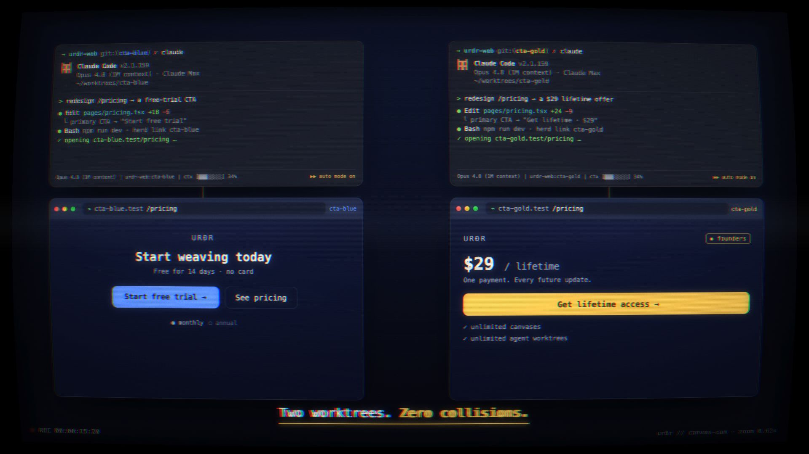

# AgentCanvas

### An infinite canvas for orchestrating AI agents, terminals, and browsers — side by side.

[**Website**](https://agentcanvas.com) · [**Download**](https://agentcanvas.com/download) · [**Docs**](https://agentcanvas.com/docs) · [**Join the waitlist**](https://agentcanvas.com)

---

**AgentCanvas** is a desktop app that turns your screen into an infinite, spatial workspace for working with AI coding agents. Spawn terminal tiles, live browser tiles, notes, PDFs, and task cards on a single zoomable canvas — and let your agents orchestrate *each other* across them.

▶ _Two Claude Code agents, two git worktrees, one repo — each rendering its own change. **Click to watch.**_

## Why AgentCanvas

- **Spatial, not tabbed.** Lay out every terminal, browser, and document where it makes sense. Pan and zoom an infinite canvas instead of hunting through tabs and windows.
- **Agent orchestration built in.** A terminal agent can spawn worker terminals, open browser tiles to test a site, drop notes, and generate PDF reports — all wired together with visual edges on the canvas.
- **See what your agents see.** Browser tiles render live and are driven by your agents, so you watch automated browsing and testing happen in real time.
- **Tasks as first-class tiles.** Capture work as task cards with classifications and a derived lifecycle (raw → researched → planned → executing → review → done), then harness benchmark loops when a task needs measurable iteration.
- **Group, link, and stash.** Organize related tiles into groupings, connect them with typed edges, and shelve finished work to keep the canvas clean.

## Features

| | |
|---|---|
| 🖥️ **Terminal tiles** | Full terminals on the canvas; agents can spawn and write to one another. |
| 🌐 **Browser tiles** | Live, agent-controllable browser views via CDP. |
| 📝 **Note & 📄 PDF tiles** | Markdown notes and rendered, searchable PDF documents. |
| ✅ **Task & 📊 benchmark tiles** | Structured work items with lifecycle state and score-driven iteration loops. |
| 🔗 **Groupings & edges** | Spatial organization with visual relationships between tiles. |
| 🔔 **Notifications** | Toast notifications surfaced from agents back into the UI. |

## Status

AgentCanvas is in **active development**. Head to [agentcanvas.com](https://agentcanvas.com) to learn more and join the waitlist.

## Links

- 🌍 Website — https://agentcanvas.com
- ⬇️ Download — https://agentcanvas.com/download
- 📚 Documentation — https://agentcanvas.com/docs

---

© 2026 AgentCanvas. All rights reserved.

